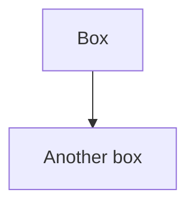

# Hdos Documentation Site

Docusaurus 3 site cho Hdos, kiến trúc theo **Diátaxis + C4 + ADR**.

## Cấu trúc

```
docs-site/
├── docusaurus.config.js          # config + mermaid theme
├── sidebars.js                   # 2 sidebar: main + adr
├── package.json
├── src/css/custom.css            # theme + ADR badges
├── static/                       # asset tĩnh (favicon, diagram raw)
└── docs/
    ├── intro.md                  # landing
    ├── tutorials/                # Diátaxis: học từ 0
    ├── how-to/                   # Diátaxis: giải task cụ thể
    ├── reference/                # Diátaxis: tra cứu
    ├── explanation/              # Diátaxis: hiểu vì sao
    │   └── c4/                   # C4 model — Context/Container/Component
    └── adr/                      # Architecture Decision Records
        ├── index.md
        ├── template.md
        ├── 0001-…md
        └── 0002-…md
```

## Setup lần đầu

> **Yêu cầu:** Node.js ≥ 18

```bash
cd docs-site
npm install
```

`@docusaurus/theme-mermaid` đã có trong `package.json` — không cần plugin riêng để render C4 diagrams.

## Chạy dev

```bash
npm start
```

Mở http://localhost:3000. Hot reload khi sửa file markdown.

## Build production

```bash
npm run build
npm run serve   # preview local
```

Output ở `build/`. Deploy bằng:

- **GitHub Pages**: `GIT_USER=<user> npm run deploy`
- **Vercel/Netlify**: trỏ root vào `docs-site/`, build command `npm run build`, output `build`
- **Docker/nginx**: copy `build/` vào nginx static

## Mermaid — render C4 diagrams

Đã được bật sẵn trong `docusaurus.config.js`:

```js
markdown: { mermaid: true },
themes: ['@docusaurus/theme-mermaid'],
```

Trong file `.md`, viết:

````markdown

````

Render trực tiếp ở browser khi visit page. **Không cần build step thêm**.

### Vì sao chọn Mermaid thay vì PlantUML?

| | Mermaid | PlantUML |
|---|---|---|
| Render | Browser (JS) | Server-side, cần Java |
| C4 syntax | `flowchart` + style class | C4-PlantUML lib chuẩn hơn |
| GitHub render | ✅ | ❌ (cần image) |
| Setup Docusaurus | 1 dòng config | Cần plugin remote-content |
| Diagrams as code | ✅ | ✅ |

→ Mermaid đơn giản hơn, đủ cho C4 ở mức Context/Container/Component. Nếu sau này cần C4 chuẩn nghiêm ngặt với boundary nested phức tạp, có thể đổi sang PlantUML qua [docusaurus-plugin-plantuml](https://www.npmjs.com/package/docusaurus-plugin-plantuml).

## Thêm tài liệu mới

### Thêm 1 trang Tutorial / How-to / Reference / Explanation

1. Tạo file `.md` trong folder tương ứng dưới `docs/`
2. Frontmatter tối thiểu:
   ```yaml
   ---
   title: Tên hiển thị
   sidebar_position: <số>
   description: 1 câu mô tả ngắn (cho SEO + index page)
   tags: [tag1, tag2]
   ---
   ```
3. Cập nhật `sidebars.js` — thêm id vào array của category.

### Thêm 1 ADR mới

```bash
cp docs/adr/template.md docs/adr/0003-ten-quyet-dinh.md
```

1. Sửa frontmatter (`title`, `sidebar_position`, `tags`).
2. Set status `Proposed` ban đầu.
3. Khi PR merge → đổi thành `Accepted`, thêm row vào `docs/adr/index.md`.
4. Thêm id vào `sidebars.js` (mục `adrSidebar`).

## Tag & search

- Tag được khai báo trong frontmatter `tags: [...]`
- Docusaurus tự sinh trang tag tại `/tags/<tag-name>`
- Search built-in: dùng plugin `@docusaurus/theme-search-algolia` (cần đăng ký) hoặc local search [docusaurus-search-local](https://github.com/easyops-cn/docusaurus-search-local):

```bash
npm i -D @easyops-cn/docusaurus-search-local
```

Thêm vào `docusaurus.config.js`:

```js
themes: [
  '@docusaurus/theme-mermaid',
  ['@easyops-cn/docusaurus-search-local', {
    hashed: true,
    language: ['en', 'vi'],
    indexDocs: true,
    indexBlog: false,
  }],
],
```

## Migration từ `docs/` cũ

Folder `docs/` ở repo root vẫn giữ — bạn migrate dần file vào `docs-site/docs/<quadrant>/` theo Diátaxis. Đề xuất mapping:

| File cũ | → Vị trí mới |
|---|---|
| `01-kien-truc-tong-quan.md` | `explanation/why-clean-architecture.md` + C4 diagrams |
| `02-cau-truc-thu-muc.md` | `reference/folder-structure.md` |
| `03-building-blocks.md` | `reference/building-blocks.md` |
| `04-feature-auth.md` | `reference/features/auth.md` |
| `05-feature-order.md` | `reference/features/order.md` |
| `06-feature-notification.md` | `reference/features/notification.md` |
| `07-grpc.md` | `explanation/grpc.md` + ADR-0002 |
| `08-rabbitmq.md` | `explanation/rabbitmq.md` |
| `09-api-gateway.md` | `reference/api-gateway.md` |
| `10-them-feature-moi.md` | `tutorials/add-first-feature.md` (đã có sẵn skeleton) |
| `11-domain-events.md` | `explanation/domain-vs-integration-events.md` (đã có) |
| `12-testing.md` | `how-to/run-tests.md` |
| `13-migrations.md` | `how-to/create-migration.md` (đã có) |
| `14-bao-mat-jwt.md` | `explanation/jwt-security-model.md` |
| `15-signalr.md` | `explanation/realtime-signalr.md` |
| `16-luong-request-auth.md` | `explanation/request-flow.md` |

## Convention

- Frontmatter `tags: [tutorial|how-to|reference|explanation|adr, ...]` để filter
- ADR có status badge qua class CSS `badge-adr badge-adr-{accepted|proposed|deprecated|superseded}` (đã định nghĩa trong `src/css/custom.css`)
- File path code excerpt: ` ```csharp:src/path/file.cs ` để Docusaurus highlight + reader copy được path
