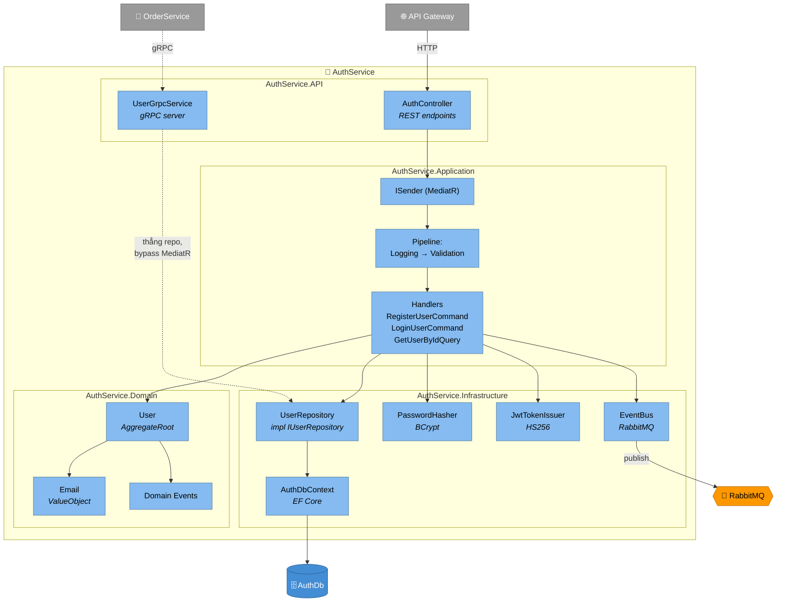

# C4 Level 3 — Component (AuthService)

Zoom vào trong **AuthService** (từ level [Container](./container)). Mỗi "component" = 1 logical grouping của class (~ 1 folder hoặc 1 lớp có tên rõ ràng).

## Diagram

## Chú thích

| Component | Tầng | Vai trò |
|---|---|---|
| `AuthController` | API | REST endpoint, dispatch qua `ISender` |
| `UserGrpcService` | API | gRPC server, gọi thẳng `IUserRepository` (bypass MediatR cho read tốc độ cao) |
| `Pipeline` | Application | `IPipelineBehavior`: log + validate trước khi vào Handler |
| `Handlers` | Application | 1 Command/Query = 1 Handler, return `Result<T>` |
| `User` | Domain | Aggregate, có factory `Register()` raise domain event |
| `UserRepository` | Infrastructure | Impl `IUserRepository` qua EF Core |
| `EventBus` | Infrastructure | Publish `IntegrationEvent` lên RabbitMQ |
| `JwtTokenIssuer` | Infrastructure | Ký JWT HS256, đọc `Jwt:Secret` |

## Quan sát thiết kế

- **Dependency direction**: Domain ← Application ← Infrastructure & API. Domain không reference component bên dưới.
- **gRPC bypass MediatR**: read-only call nhỏ, không cần Validation/Logging pipeline. Trade-off có document trong [ADR-0001](../../adr/0001-record-architecture-decisions).
- **Email là ValueObject**: format validate ở `Email.Create(...)`, không phải responsibility của Handler.
