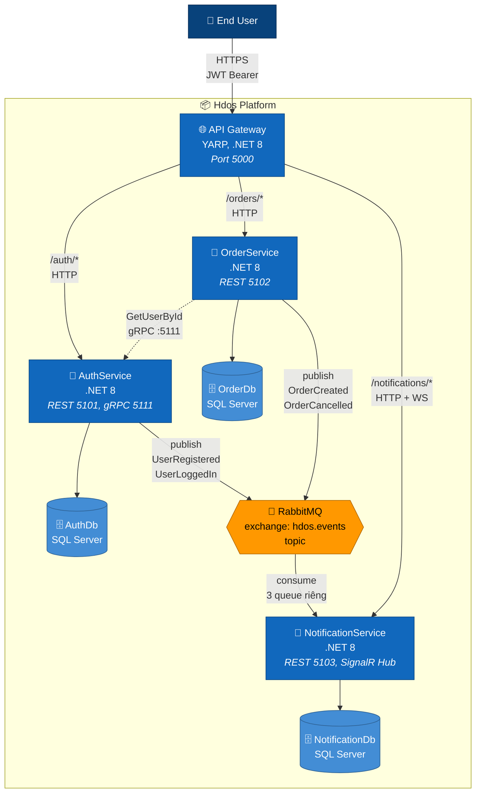

# C4 Level 2 — Container

Zoom vào bên trong **Hdos Platform** (từ level [Context](./context)). Mỗi "container" = 1 deployable unit (một process runtime, một DB instance, một queue).

## Diagram

## Chú thích

| Container | Tech | Trách nhiệm |
|---|---|---|
| API Gateway | YARP | Reverse proxy, áp `AuthorizationPolicy` per route |
| AuthService | .NET 8 | User CRUD, login, JWT issuer, gRPC user lookup server |
| OrderService | .NET 8 | Order CRUD, gọi gRPC verify user, publish `OrderCreated` |
| NotificationService | .NET 8 | Consume Rabbit, lưu noti, push realtime qua SignalR |
| 3 SQL Database | SQL Server | Tách DB per service — không share schema |
| RabbitMQ | RabbitMQ | Topic exchange `hdos.events`, mỗi consumer 1 queue riêng |

## Quyết định kiến trúc liên quan

- [ADR-0002: Tách port REST/gRPC](../../adr/0002-split-rest-grpc-ports)

## Kế tiếp

Zoom vào trong 1 service: [C4 Component — AuthService](./component-auth).
