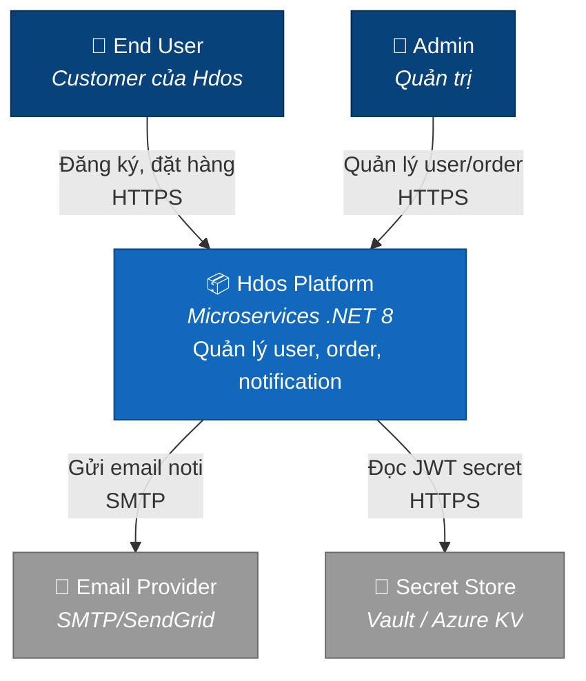

# C4 Level 1 — System Context

> **C4 Model**: 4 levels — Context (zoom out nhất) → Container → Component → Code.

Mục đích level 1: **non-technical reader** cũng đọc được. Trả lời:
*Hdos là gì, ai dùng, nó nói chuyện với hệ ngoài nào?*

## Diagram

## Chú thích

| Phần tử | Vai trò |
|---|---|
| 👤 **End User** | Người dùng cuối — gọi REST API qua FE/Postman |
| 👤 **Admin** | Quản trị — view dashboard, list orders |
| 📦 **Hdos Platform** | Hệ thống bạn đang xây — *zoom in ở [Container](./container)* |
| 📧 **Email Provider** | Bên ngoài — gửi email khi `UserRegistered` |
| 🔐 **Secret Store** | Bên ngoài — lưu JWT secret, DB password |

## Kế tiếp

Zoom vào trong Hdos: [C4 Container](./container).
