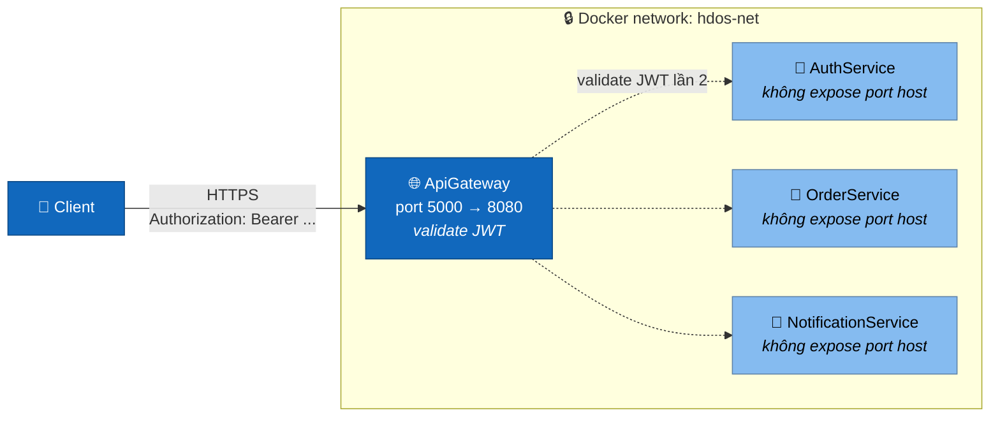

# Explanation — Mô hình bảo mật của Hdos

> **Loại:** Explanation · **Mục đích:** Hiểu *vì sao* dùng cấu hình network + JWT thế này, không phải hướng dẫn config.

> **Phạm vi hiện tại**: chỉ kiểm tra "có token hợp lệ hay không". Phân quyền chi tiết (role, permission) chưa làm — xem mục [Hướng phát triển](#hướng-phát-triển-tiếp).

## 1. Mô hình tổng



Hai lớp chồng nhau:

1. **Lớp 1 — Network**: chỉ Gateway expose port ra host. 3 service nội bộ chỉ tồn tại trên Docker network `hdos-net`.
2. **Lớp 2 — JWT**: AuthService phát token sau khi login. Gateway và mỗi service tự validate. Thiếu/sai token → 401.

## 2. Lớp 1 — Network isolation

```yaml:docker-compose.yml
authservice:
  # KHÔNG có block "ports:" → chỉ reach qua hdos-net
  networks: [hdos-net]

orderservice:
  networks: [hdos-net]
  # KHÔNG có "ports:"

apigateway:
  ports:
    - "5000:8080"      # cửa duy nhất ra ngoài
  networks: [hdos-net]
```

**Hệ quả thực tế**: `curl http://localhost:5102/orders` từ máy host sẽ **fail** (Connection refused). Muốn truy cập phải đi qua `http://localhost:5000/orders`.

Service vẫn nói chuyện nhau bình thường qua hostname Docker (`http://authservice:8080`).

> Khi chạy local **không** Docker (`dotnet run` 4 process), service vẫn bind `5101/5102/5103` trên `localhost`. Đây là dev environment, không phải prod.

## 3. Lớp 2 — JWT validation

### 3.1 Cấu hình share

```json
"Jwt": {
  "Secret": "REPLACE_WITH_32+_CHAR_RANDOM_STRING",
  "Issuer": "Hdos.Auth",
  "Audience": "Hdos.Services",
  "ExpiresMinutes": 60
}
```

Cùng `Secret/Issuer/Audience` ở Gateway và 3 service → ai có secret là verify được token offline, **không phải gọi lại AuthService**.

```bash
# Override prod
export JWT_SECRET="$(openssl rand -base64 48)"
docker compose up --build
```

### 3.2 Building blocks

`src/BuildingBlocks/Common/Auth/`:

| File | Vai trò |
|---|---|
| `JwtOptions.cs` | POCO map từ section `Jwt` |
| `IJwtTokenIssuer.cs` | Hợp đồng phát token (chỉ AuthService dùng) |
| `JwtTokenIssuer.cs` | Sinh JWT HS256 với claims `sub`, `email`, `jti` |
| `JwtAuthExtensions.cs` | `AddHdosJwtAuth()` validator + `AddHdosJwtIssuer()` issuer |

### 3.3 Routing policy ở Gateway

```json:src/ApiGateway/appsettings.json
"Routes": {
  "auth-route":          { "AuthorizationPolicy": "Anonymous", "Match": { "Path": "/auth/{**catch-all}" } },
  "orders-health-route": { "AuthorizationPolicy": "Anonymous", "Match": { "Path": "/orders/health" } },
  "orders-route":        { "AuthorizationPolicy": "Default",   "Match": { "Path": "/orders/{**catch-all}" } },
  "notifications-route": { "AuthorizationPolicy": "Default",   "Match": { "Path": "/notifications/{**catch-all}" } }
}
```

YARP match route cụ thể trước → `/orders/health` ăn route `Anonymous`, các path khác `/orders/...` ăn `Default`.

## 4. Vì sao validate JWT 2 lần?

| Lý do | Giải thích |
|---|---|
| **Defense in depth** | Nếu ai gọi thẳng port nội bộ (rò mạng, deploy nhầm `ports:`…), service vẫn từ chối |
| **Service tự dùng claim** | Action cần `userId/email` → phải có `HttpContext.User` thật, không thể trust header |
| **Tách trách nhiệm** | Gateway có thể bị thay (Nginx/Traefik) mà service không phải đổi |
| **Chi phí gần như 0** | HMAC verify offline rất nhanh, không round-trip |

**Đánh đổi**: cả 2 tầng phải share secret. Cách tốt hơn là chuyển sang RS256 — xem [Hướng phát triển](#hướng-phát-triển-tiếp).

## 5. Luồng end-to-end

```bash
# 1) Đăng ký
curl -X POST http://localhost:5000/auth/register \
  -H "Content-Type: application/json" \
  -d '{"email":"alice@hdos.io","fullName":"Alice","password":"secret123"}'

# 2) Login → lấy token
TOKEN=$(curl -s -X POST http://localhost:5000/auth/login \
  -H "Content-Type: application/json" \
  -d '{"email":"alice@hdos.io","password":"secret123"}' \
  | jq -r '.data.token')

# 3) Tạo order (KHÔNG token → 401)
curl -X POST http://localhost:5000/orders \
  -H "Authorization: Bearer $TOKEN" \
  -H "Content-Type: application/json" \
  -d '{ "items":[...] }'
```

Test "đường vòng" để verify lớp Network:

```bash
# Sẽ fail "Connection refused" vì port không bind ra host
curl -v http://localhost:5102/orders/health
```

## 6. Hướng phát triển tiếp

- **Roles & permissions** — thêm claim `roles` lúc issue token, áp `[Authorize(Policy = "OrderAdmin")]`
- **Refresh token + revoke list** — lưu `jti` blacklist trong Redis
- **HS256 → RS256** — AuthService giữ private key, service chỉ giữ public key qua JWKS endpoint `/.well-known/jwks.json`. Rotate key dễ hơn nhiều.
- **Secret → Vault** — đưa ra AWS Secrets Manager / Azure Key Vault thay vì env compose
- **gRPC `[Authorize]`** — áp khi mở `UserGrpcService` ra ngoài cluster

## Liên quan

- [How-to: Add authentication](../how-to/add-authentication)
- [How-to: Debug 401](../how-to/debug-401)
- [Request flow end-to-end](./request-flow)
