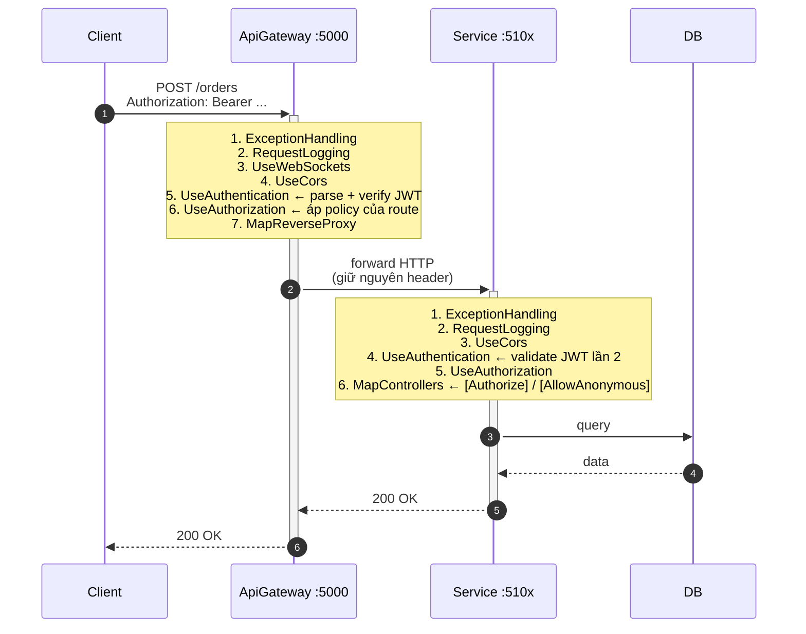

# Explanation — Luồng request end-to-end

> **Loại:** Explanation · **Pre-req:** Đã đọc [JWT security model](./jwt-security-model)

Trả lời câu hỏi: **một HTTP request đi từ client vào Hdos sẽ qua những tầng nào, mỗi tầng làm gì với JWT, khi nào bị reject?**

## 1. Sơ đồ tổng



**Điểm cốt lõi**: mọi service share cùng 1 `Jwt` config (Secret + Issuer + Audience). Vì JWT ký bằng HMAC-SHA256 (symmetric), service nào có secret là verify offline được — không phải gọi lại AuthService.

## 2. Vì sao thứ tự pipeline quan trọng

### 2.1 Gateway

```csharp:src/ApiGateway/Program.cs
var app = builder.Build();

app.UseHdosMiddleware();   // ExceptionHandling → RequestLogging
app.UseWebSockets();       // bắt buộc đứng trước Auth để upgrade chạy được
app.UseHdosCors();

app.UseAuthentication();   // (5) parse Bearer token, gắn HttpContext.User
app.UseAuthorization();    // (6) áp AuthorizationPolicy của route

app.MapReverseProxy()      // (8) YARP — chỉ gọi khi đã pass authorization
   .RequireCors(HdosCorsPolicy);
```

**Quy tắc**: Authentication trước Authorization, cả 2 trước MapReverseProxy.

Đảo thứ tự ⇒ YARP forward request trước khi check token ⇒ service con vẫn nhận được request "lậu" (vẫn từ chối được nhờ defense-in-depth, nhưng đó là backup).

### 2.2 Service

```csharp:src/Services/OrderService/OrderService.API/Program.cs
app.UseHdosMiddleware();
app.UseHdosCors();
app.UseAuthentication();   // validate JWT lần 2
app.UseAuthorization();
app.MapControllers();      // [Authorize] / [AllowAnonymous] kích hoạt ở đây
```

3 service đều có pipeline giống hệt — đều gọi `AddHdosJwtAuth(builder.Configuration)` với cùng section `Jwt`.

## 3. Trace `POST /orders` thật

### Bước 0 — Lấy token

```bash
TOKEN=$(curl -s -X POST http://localhost:5000/auth/login \
  -H "Content-Type: application/json" \
  -d '{"email":"alice@hdos.io","password":"secret123"}' \
  | jq -r '.data.token')
```

Đường đi:

1. Gateway match route `auth-route` với `AuthorizationPolicy: "Anonymous"` ⇒ skip kiểm token
2. YARP forward sang `http://localhost:5101/auth/login`
3. AuthService — `AuthController.Login` đánh `[AllowAnonymous]`
4. `LoginUserCommandHandler` verify password rồi gọi `IJwtTokenIssuer.Issue(userId, email)`:
   - Ký HS256 bằng `Jwt:Secret`
   - Claims: `sub = userId`, `email`, `jti = Guid`, kèm `iss`, `aud`, `nbf`, `exp`

Kết quả: chuỗi JWT 3 phần `<header>.<payload>.<signature>`.

### Bước 1 — Client gửi request

```bash
curl -X POST http://localhost:5000/orders \
  -H "Authorization: Bearer $TOKEN" \
  -H "Content-Type: application/json" \
  -d '{ "items":[...] }'
```

### Bước 2 — Tại Gateway

**(a) Authentication** — `JwtAuthExtensions.cs`:

```csharp
o.TokenValidationParameters = new TokenValidationParameters
{
    ValidateIssuer = true,                        // iss == "Hdos.Auth"?
    ValidateAudience = true,                      // aud == "Hdos.Services"?
    ValidateLifetime = true,                      // còn hạn không (ClockSkew 30s)
    ValidateIssuerSigningKey = true,              // chữ ký HS256 đúng secret?
    ValidIssuer   = options.Issuer,
    ValidAudience = options.Audience,
    IssuerSigningKey = new SymmetricSecurityKey(
        Encoding.UTF8.GetBytes(options.Secret)),
    ClockSkew = TimeSpan.FromSeconds(30),
};
```

Pass ⇒ `HttpContext.User` được set thành `ClaimsPrincipal` chứa các claim từ payload.
Fail ⇒ `User` vẫn là anonymous (chưa 401 ngay — bước Authorization mới quyết).

**(b) Authorization theo route YARP**:

```json
"orders-route": {
  "ClusterId": "orders-cluster",
  "AuthorizationPolicy": "Default",
  "Match": { "Path": "/orders/{**catch-all}" }
}
```

- `Default` = `RequireAuthenticatedUser` ⇒ token sai/hết hạn/không có ⇒ **401 ngay tại gateway**, không forward
- `Anonymous` = bỏ qua kiểm tra (dùng cho `/auth/*`, `/orders/health`, `/orders/swagger/*`)

**(c) YARP forward** — đẩy request sang `http://localhost:5102/orders` (Docker thì `http://orderservice:8080/orders`). **Header `Authorization` được giữ nguyên** ⇒ service đọc được.

### Bước 3 — Tại OrderService

**(a) Authentication lần 2** — pipeline giống Gateway, cùng secret/issuer/audience ⇒ verify offline. Pass ⇒ `HttpContext.User` ở service cũng đầy đủ claims.

**(b) Authorization ở controller**:

```csharp
[ApiController]
[Route("orders")]
[Authorize]                                  // mọi action mặc định cần token
public sealed class OrdersController : ControllerBase
{
    [HttpPost]
    public async Task<IActionResult> Create(...) { ... }

    [AllowAnonymous]
    [HttpGet("health")]                      // health ngoại lệ
    public IActionResult Health() => ...;
}
```

`[Authorize]` ở class-level ⇒ tất cả action thừa kế. `[AllowAnonymous]` ở method override class-level — ASP.NET Core ưu tiên cấp method.

**(c) Đọc claim trong action**:

```csharp
var userId = Guid.Parse(User.FindFirstValue(ClaimTypes.NameIdentifier)!);
var email  = User.FindFirstValue(ClaimTypes.Email);
```

> `JwtSecurityTokenHandler` mặc định remap `sub` → `ClaimTypes.NameIdentifier` và `email` → `ClaimTypes.Email`. Muốn lấy đúng tên claim gốc cần `JwtSecurityTokenHandler.DefaultMapInboundClaims = false;` ở `Program.cs`.

## 4. Trường hợp đặc biệt

### 4.1 SignalR / WebSocket

WebSocket không gắn được header `Authorization` lúc upgrade ⇒ token gửi qua query: `wss://.../notifications/hubs/notifications?access_token=...`

```csharp:src/BuildingBlocks/Common/Auth/JwtAuthExtensions.cs
o.Events = new JwtBearerEvents
{
    OnMessageReceived = ctx =>
    {
        var accessToken = ctx.Request.Query["access_token"];
        var path = ctx.HttpContext.Request.Path;
        if (!string.IsNullOrEmpty(accessToken) && path.HasValue &&
            path.Value!.Contains("/hubs/", StringComparison.OrdinalIgnoreCase))
            ctx.Token = accessToken;
        return Task.CompletedTask;
    }
};
```

### 4.2 gRPC service-to-service

OrderService → AuthService qua gRPC port 5111. **Hiện không gắn `[Authorize]`** vì kênh nội bộ trên Docker network. Nếu mở ra cluster lớn ⇒ thêm `.RequireAuthorization()` và client phải đính token vào metadata.

### 4.3 Endpoint anonymous

| Loại | Cấu hình |
|---|---|
| `/auth/*` | Route `Anonymous` (Gateway) + `[AllowAnonymous]` (controller) |
| `/<svc>/health` | Route `Anonymous` riêng cho từng service |
| `/<svc>/swagger/*` | Route `Anonymous` riêng — mở Swagger UI không cần token |
| Gateway `/`, `/health` | `.AllowAnonymous()` trên minimal API |

## 5. Bảng lỗi thường gặp

Đã extract sang [How-to: Debug 401](../how-to/debug-401) — bảng tra cứu lỗi nên ở How-to, không phải Explanation.

## 6. Tài liệu tham khảo

- [JWT — RFC 7519](https://datatracker.ietf.org/doc/html/rfc7519)
- [JWS — RFC 7515](https://datatracker.ietf.org/doc/html/rfc7515)
- [Bearer token — RFC 6750](https://datatracker.ietf.org/doc/html/rfc6750)
- [ASP.NET Core JWT Bearer](https://learn.microsoft.com/aspnet/core/security/authentication/jwt-authn)
- [YARP Authorization in routes](https://microsoft.github.io/reverse-proxy/articles/authn-authz.html)
- [SignalR Bearer token authentication](https://learn.microsoft.com/aspnet/core/signalr/authn-and-authz#bearer-token-authentication)

## Liên quan

- [JWT security model](./jwt-security-model)
- [How-to: Debug 401](../how-to/debug-401)
- [How-to: Add authentication](../how-to/add-authentication)
