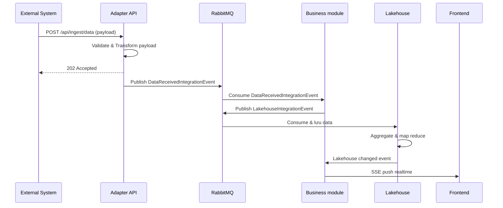

# 20 - Adapter Ingest Gateway

## Tổng quan

External Project bắn data vào **Adapter API** của hệ thống. API publish event lên **RabbitMQ**. Các **Service** subscribe RabbitMQ, mỗi service xử lý nghiệp vụ riêng — bên trong service đó mới publish sang Lakehouse hoặc push lên Frontend.

---

## Sequence Diagram



---

## Chi tiết luồng

### Source (đã có sẵn)


| Thành phần | Vai trò                                                        |
| ------------ | --------------------------------------------------------------- |
| Adapter API  | Nhận data từ External, validate, normalize rồi publish event |
| RabbitMQ     | Bus trung gian — distribute event tới các service            |

### Services (consumers)


| Service   | Consume từ MQ                 | Làm gì bên trong                                                   |
| --------- | ------------------------------ | --------------------------------------------------------------------- |
| Service A | `DataReceivedIntegrationEvent` | Publish`LakehouseIntegrationEvent` lên RabbitMQ → Lakehouse consume |
| Service A | Lakehouse changed event        | Lakehouse thay đổi → bắn về Service A → SSE push lên Frontend  |

### Luồng ngược từ Lakehouse

Khi Lakehouse có thay đổi dữ liệu, nó bắn thẳng về Service A. Service A SSE push lên Frontend — không qua API hay RabbitMQ.

---

## API Contract (draft)

```
POST /api/ingest/data
Content-Type: application/json
Authorization: Bearer <token>
```

```json
// Request
{
  "source": "external-project-name",
  "timestamp": "2026-05-20T10:00:00Z",
  "payload": { }
}

// Response 202
{
  "eventId": "uuid",
  "receivedAt": "2026-05-20T10:00:00Z",
  "status": "queued"
}
```

---

## Integration Event

```csharp
public record DataReceivedIntegrationEvent(
    Guid EventId,
    string Source,
    DateTime ReceivedAt,
    object NormalizedPayload
) : IntegrationEvent;
```

---

## TODO

- [ ]  Xác định format payload từ External Project
- [ ]  Service A và Service B là 1 hay 2 service riêng?
- [ ]  Xác định loại realtime transport cho Frontend: SignalR hay SSE
- [ ]  Định nghĩa authentication cho endpoint ingest (API Key hay JWT)
- [ ]  Thêm dead-letter queue cho consumer fail liên tục
